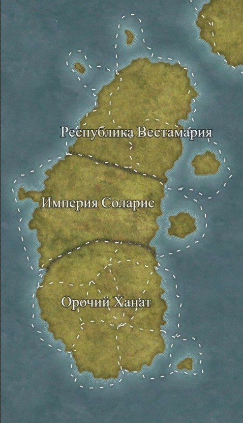
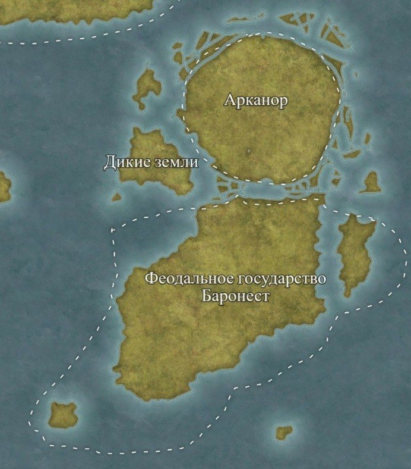
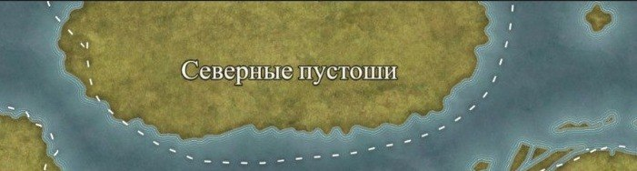

## 🌐 Континенты мира Apotheval
### 🌄 Западный Континент
Западный континент — огромный жаркий материк, где цивилизация соседствует с дикой природой. В центре расположены земли Империи — ухоженный, плодородный регион с городами, полями и храмами. Он остаётся зелёным благодаря молитвам верующих, которые поддерживают жизнь растений и животных в условиях постоянной жары. Империя веками удерживает этот оазис стабильности среди суровых земель.

Юг материка — бескрайние песчаные равнины, море песка, где солнце беспощадно, а ветра поднимают пыльные бури. Здесь живут орки, минотавры и другие народы, привыкшие к тяжёлым условиям. Их кланы кочуют между оазисами, сражаются за воду и охотятся на пустынных чудовищ. Несмотря на суровость, юг поражает красотой: кроваво‑красные закаты и звёздные ночи делают эти земли уникальными.

Север континента занимает Республика зверолюдей — молодое, но быстро развивающееся государство. Климат здесь мягкий и дружелюбный: тёплые ветра, плодородные земли, широкие луга и спокойные реки. Благодаря этому зверолюди смогли построить устойчивую систему поселений, ремёсел и торговли. Республика известна своей культурой, уважением к природе и умением сочетать инстинкты с разумом. Север часто называют «улыбкой континента» — настолько он отличается от сурового юга и жаркого центра.

Между землями Империи и южными кланами лежат джунгли Тамань — густые, влажные и опасные. Они служат естественной границей между цивилизованными регионами и пустошами. Тамань — место, где природа правит сама собой: древние деревья образуют плотные стены, туман скрывает руины храмов, а местные племена живут по собственным законам, не признавая ни Империю, ни кланы.

Западный континент — это сочетание ухоженных земель Империи, беспощадных песков юга, развитой Республики зверолюдей на севере и диких джунглей Тамань. Контрастный, живой и разнообразный, он формирует основу мира Apotheval.

Картография:

### 🌿 Восточный Континент
Климат: мягкий, благоприятный, разнообразный.
Общий образ: самый «живой» континент — цветущие леса, холмы, реки, богатая природа.

Характерные черты:

умеренный климат

густые леса и плодородные земли

множество небольших королевств и кланов

развитое земледелие

магические рощи и древние святилища

Население:

лесные эльфы

люди‑земледельцы

друидические племена

гномы‑ремесленники

Экономика:

древесина

сельское хозяйство

ремёсла

магические травы

Место для изображения:

Картография

### ❄️ Северный Континент (Северные Пустоши)
Климат: крайне холодный, суровый, непредсказуемый.
Общий образ: земля льда, ветров и туманов, о которой почти ничего не известно.

Характерные черты:

вечная мерзлота

снежные равнины

ледяные шторма

редкие следы древних цивилизаций

опасные чудовища

Что о нём известно:

путешественники почти не возвращаются

карты неполные и противоречивые

считается, что там живут варварские племена

многие уверены, что континент проклят

Население (предположительно):

северные варвары

ледяные великаны

духи холода

Экономика:

неизвестна

редкие экспедиции привозят магические кристаллы и странные артефакты

Картография

